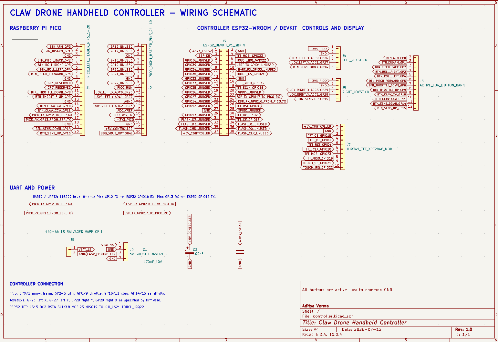
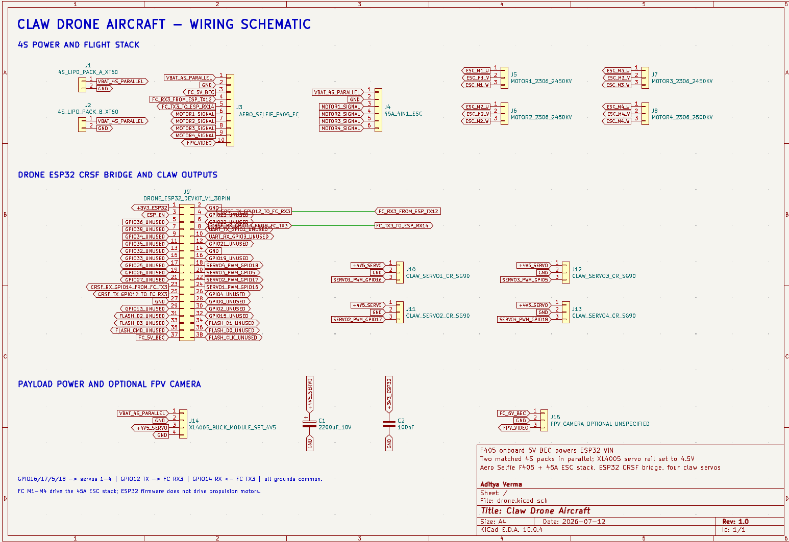

# Claw Drone


This is a payload quadcopter with four continuous-rotation claw
servos to grab objects. I build a custom controller with
two joysticks, trim buttons, a TFT dashboard, and direct claw controls.
The transmitter uses ESPNOW long range to send CRSF commands at 200hz, where another RX es32 onboard converts them into CRSF for the FC to interpret.

I built this as a way to further myself in the knowledge of drones and aerial payload delivery.

The CAD, BOM, and FIRMWARE for both the controller and the drone are in this repo

This project started with an esp32 as the FC, but later changed to using a conventional ESC+FC stack.

## Demo

[Watch the competition flight demo on YouTube](https://youtube.com/shorts/Rw3jiggKQBY)

## System architecture

```text
Joysticks and buttons
        |
        v
Black Pill Pico-compatible board -- UART 115200 --> Controller ESP32-WROOM
                                           |
                                           | ESP-NOW LR, channel 6
                                           v
                                    Drone ESP32-WROOM
                                      |           |
                           CRSF UART3 |           | 4 x 50 Hz PWM
                                      v           v
                              Betaflight FC    Claw servos
                                      |
                                      v
                                ESC and motors
```


## Wiring schematics


### Handheld controller schematic




### Aircraft schematic




## Bill of materials

| Assembly   |  Quantity | Part                          | Purchase Link                                                      |      Estimated Price |
| ---------- | --------: | ----------------------------- | ------------------------------------------------------------------ | -------------------: |
| Aircraft   |         1 | Frame                         | [AliExpress](https://www.aliexpress.us/item/3256811569379527.html) |               $17.06 |
| Aircraft   |         1 | FC + ESC stack                | [AliExpress](https://www.aliexpress.us/item/3256808946065124.html) |               $49.63 |
| Aircraft   |         4 | Brushless motors              | [AliExpress](https://www.aliexpress.us/item/3256812458735650.html) |               $61.36 |
| Aircraft   |     1 set | Propellers                    | [AliExpress](https://www.aliexpress.us/item/2255801043927518.html) |               $15.25 |
| Aircraft   |         2 | Flight batteries              | [AliExpress](https://www.aliexpress.us/item/3256812540292605.html) |               $30.34 |
| Aircraft   |         1 | XT60 connectors               | [AliExpress](https://www.aliexpress.us/item/3256807605726245.html) |                $1.77 |
| Aircraft   |         1 | ESP32                         | [AliExpress](https://www.aliexpress.us/item/3256808984038785.html) |                $4.84 |
| Aircraft   |         4 | Servos                        | [AliExpress](https://www.aliexpress.us/item/3256809795714797.html) |           $3.63 used |
| Aircraft   |         1 | XL4005 buck converter         | [AliExpress](https://www.aliexpress.us/item/3256806558389509.html) |                $1.46 |
| Aircraft   |         1 | Camera                        | [AliExpress](https://www.aliexpress.us/item/3256810060131517.html) |               $25.90 |
| Aircraft   |         1 | 3D-printing allowance         | [AliExpress](https://www.aliexpress.us/item/3256806989098121.html) |                $2.54 |
| Aircraft   | As needed | Wiring                        | [AliExpress](https://www.aliexpress.us/item/3256809610137308.html) |      $5.49 allowance |
| Aircraft   | As needed | Connectors                    | [AliExpress](https://www.aliexpress.us/item/3256804089626824.html) | $3.81 assortment kit |
| Controller |         1 | Raspberry Pi Pico             | [AliExpress](https://www.aliexpress.us/item/3256805910466139.html) |                $4.35 |
| Controller |         1 | ESP32                         | [AliExpress](https://www.aliexpress.us/item/3256808984038785.html) |                $4.84 |
| Controller |         1 | TFT touchscreen display       | [AliExpress](https://www.aliexpress.us/item/2255800128937536.html) |               $10.87 |
| Controller |         2 | Joystick modules              | [AliExpress](https://www.aliexpress.us/item/3256809884616435.html) |                $5.76 |
| Controller |        10 | Pushbuttons                   | [AliExpress](https://www.aliexpress.us/item/3256801710165519.html) |                $3.32 |
| Controller |         1 | Controller battery            | [AliExpress](https://www.aliexpress.us/item/3256809090690409.html) |                $4.24 |
| Controller |         1 | Boost converter               | [AliExpress](https://www.aliexpress.us/item/3256810344563800.html) |                $0.99 |
| Controller |         1 | TP4056 charger module         | [AliExpress](https://www.aliexpress.us/item/3256808777213556.html) |           $0.20 used |
| Controller |         1 | Power switch                  | [AliExpress](https://www.aliexpress.us/item/3256807619399290.html) |           $0.16 used |
| Controller |         1 | Bulk capacitor                | [AliExpress](https://www.aliexpress.us/item/2251832671851361.html) |           $0.10 used |
| Controller |         1 | Decoupling capacitor          | [AliExpress](https://www.aliexpress.us/item/3256811560978404.html) |           $0.01 used |
| Controller |         1 | Controller filament allowance | [AliExpress](https://www.aliexpress.us/item/3256806989098121.html) |                $3.04 |
| Controller | As needed | Wiring                        | [AliExpress](https://www.aliexpress.us/item/3256809610137308.html) |      $5.49 allowance |

## Assembly process

### Print settings

The prototype was printed in PETG on an Anycubic Kobra S1 using 100% infill,
10 walls, and a 0.2 mm layer height. The printable files are in
[`CAD/Individual STL files`](CAD/Individual%20STL%20files), with matching STEP
exports in [`CAD/Individual STEP files`](CAD/Individual%20STEP%20files).

Use [Building Your First 5-Inch FPV Drone: A Complete Step-by-Step Guide](https://blog.uavmodel.com/building-your-first-5-inch-fpv-drone-a-complete-step-by-step-guide/) for the standard FPV frame/motor/ESC+FC stack guide.


### Aircraft build

1. Build it like a normal FPV frame, like the one in the video above
  * If you have a commercial FPV frame that will work, otherwise print the frame pieces in the INDIVIDUAL STLs

2. Parallel battery connection
 
Solder two XT60 connectors; you don't even need to do this if you don't want to, as it only increases flight time while increasing weight too. Keep following what the demo video does if you don't want a parallel connection. If you do then you have to solder two XT60 wires to the ESC -/+ pads.

3. Standard FPV connections
Plug the ESP32 U.FL Wroom into the F405 5 V BEC and common ground.
This is your version of the "ELRS" the demo ideo will be talking about. Connect TX3/RX3 to esp32 RX2/TX2.
Also, for the camera you won't be using that 5.8ghz or DJI O4 mini. You will use the xiao S3 mini cam, and connect the 5V BEC and common gnd just like you did with the RX esp32.

4. Four-servos claw
3D print four SG90 mount holders and install one beneath each motor holder.
 * This is inside the Additional Attachment individual STLs, print the mirrored and normal servo claw attachment twice (4 total)
 * Also print the servo mounts to mount them with the motor mounts
Install the 10mm M3s to mount them and secure each SG90 servo to its printed holder with the self-tapping screws.
Route the servo cables along the arms to the inside. Secure them outside the motor and propeller area with zip ties.
Connect all four servo positive wires to XL4005 OUT+, and all four grounds to OUT-. Connect the PWM control lines as servo 1 – GPIO16, servo 2 – GPIO17, servo 3 – GPIO5, and servo 4 – GPIO18.

5. XL4005 claw power supply
Connect XL4005 IN+ directly to the ESC BAT+ pad and IN- to BAT-.
Make sure to set the voltage to 4.5v Connect all four servos to a common gnd with the esp32.


### Handheld controller build

1. Enclosure preparation
Print all of the INDIVIDUAL STLs, get soldering iron, flux, and a ton of thin 32AWG wire

2. Controller power supply
Mount the LIPO cell with glue.
Mount the TP4056 next to its usb port hole on the case
Connect the battery to TP4056 B+ and B-. Then, connect TP4056 OUT+ to the main toggle switch, while OUT- connects to controller ground.
Make sure its outputting 5v

3. Controller boards and antenna
Position the Black Pill board right behind the USB opening of the enclosure.
Apply glue to the flat underside of the board to mount it there.
Mount the controller ESP32 right to the left of the Black Pill board using adhesive on its flat side.
The UART connection runs from Black Pill GP12 TX to ESP32 GPIO16 RX and from Black Pill GP13 RX to ESP32 GPIO17 TX.
Install the U.FL antenna, and glue it to the top center opening.

4. Buttons
Use superglue to secure buttons.
Daisy change the grounds (easiest way to avoid messy wiring)
Connect the other terminals to their respective pi pico GPIO

5. Joysticks
Secure each joystick in its four mounting holes
Connect their 3.3/GND to pi pico, and their ADC pins to the assigned ADC gpio.

6. TFT display
Solder the ESP32 to the TFT as CS GPIO15, DC GPIO2, RST GPIO4, SCLK GPIO18, MOSI GPIO23, MISO GPIO19, touch CS GPIO21, and touch IRQ GPIO22.
TFT power connects to the regulated 5V rail.
Mount it with M3 x 25 mm screws, and route its wires to the left of the pi pico (make sure they are short or it will be hard).


## Controller pinout

USE THIS WHEN BUILDING THE CONTROLLER/DRONE

### Black Pill Picoboard

Note that you have to be using a black pill pico with 4 ADC inputs instead of 3 like the normal pi pico.

| Pico pin    | Connection             |
| ----------- | ---------------------- |
| GP0         | Button to GND          |
| GP1         | Button to GND          |
| GP2         | Button to GND          |
| GP3         | Button to GND          |
| GP4         | Button to GND          |
| GP5         | Button to GND          |
| GP6         | Not used               |
| GP7         | Not used               |
| GP8         | Button to GND          |
| GP9         | Button to GND          |
| GP10        | Button to GND          |
| GP11        | Button to GND          |
| GP12        | ESP32 GPIO16           |
| GP13        | ESP32 GPIO17           |
| GP14        | Left stick button      |
| GP15        | Right stick button     |
| GP25        | Onboard LED            |
| GP26 / ADC0 | Left joystick X        |
| GP27 / ADC1 | Left joystick Y        |
| GP28 / ADC2 | Right joystick Y       |
| GP29 / ADC3 | Right joystick X       |
| 3V3         | Joystick VCC           |
| GND         | All controller grounds |


### Pico to controller ESP32 UART

| Black Pill Pico-compatible board | Controller ESP32-WROOM |
| ----------------- | ---------------------- |
| GP12 UART0 TX     | GPIO16 UART2 RX        |
| GP13 UART0 RX     | GPIO17 UART2 TX        |
| GND               | GND                    |


### Controller TFT and touch

| Display signal | Controller ESP32 GPIO |
| -------------- | --------------------- |
| TFT CS         | GPIO15                |
| TFT DC         | GPIO2                 |
| TFT RST        | GPIO4                 |
| SPI SCLK       | GPIO18                |
| SPI MOSI       | GPIO23                |
| SPI MISO       | GPIO19                |
| Touch CS       | GPIO21                |
| Touch IRQ      | GPIO22                |
| GND            | GND                   |


## Four-leg claw system

You have to use the self tapping screws that came with the sg90 to mount them.

1. Legs spread from the center creating area around the payload.
2. All four legs move out from under the motors.


## Drone pinout

### Drone ESP32 to Betaflight flight controller

| Drone ESP32-WROOM | Flight controller |
| ----------------- | ----------------- |
| GPIO12 UART2 TX   | RX3               |
| GPIO14 UART2 RX   | TX3               |
| GND               | GND               |

UART setup for CRSF protocol.

### Drone ESP32 servo outputs

| Servo   | PWM signal pin |
| ------- | -------------- |
| Servo 1 | ESP32 GPIO16   |
| Servo 2 | ESP32 GPIO17   |
| Servo 3 | ESP32 GPIO5    |
| Servo 4 | ESP32 GPIO18   |

The FC did not have enough motor outputs to drive servos so I used the onboard ESP32.

### Servo power

Servos are powered by the XL4005 buck converter at 4.5V

## Setting up the code

Flash using micropython for the rpi, and ESP-IDF for the esp32 co-processor

On the drone use ESP-IDF, the flight controller uses betaflight

The code is in the repo folder

Every ESP32 has different values for this: 

| Device           | Wi-Fi STA MAC       |
| ---------------- | ------------------- |
| Controller ESP32 | `68:09:47:5c:04:c4` |
| Drone ESP32      | `68:09:47:5c:2f:8c` |

Update both hard-coded peer addresses as per your devices.

* `drone_mac` in
  `Code/controller/esp32_tx/main/main.c`
* `controller_mac` in
  `Code/drone/esp32_rx/main/main.c`


## Betaflight setup


Give CRSF on UART3 with this configuration:

```text
serial 1 0 115200 57600 0 115200
serial 2 64 115200 57600 0 115200
set serialrx_provider = CRSF
set serialrx_inverted = OFF
set serialrx_halfduplex = OFF
save
```


| CRSF channel | Function               |
| ------------ | ---------------------- |
| CH1          | Roll                   |
| CH2          | Pitch                  |
| CH3          | Throttle               |
| CH4          | Yaw                    |
| CH5 / AUX1   | Arm                    |
| CH6 / AUX2   | Link-active indication |

ARM mode uses AUX1.


## Design and build process

### 1. Early arm concepts

First design concept was X-frame design with 5-DoF arm.
It has been dropped because of the arm mass. Second design concept was a
frame with electronics placed near its perimeter, and an opening in its center like a DONUT.
Through this opening, servo-controlled rope and spring mechanism were going
to clamp the payload. This was abandoned though as it interfered with the rotor thrust.


### 2. Lightweight claw redesign

I had four servos underneath, and initially a 5 dof arm as the claw.


### 3. ESP32 flight-controller experiment

I used a esp32 supermini S3 but there were problems with the ESC connection and FC espnow connection leading me to abondon it.


### 4. Moving flight control to Betaflight

Switched from ESP32 FC + cheap rc airplane ESCs to conventional drone stack.


### 5. Building the custom transmitter

NRF24L01 were used at first but I switched to ESPNOW as its less wiring and reliable.


### 6. Final assembly

Everything connected together


## What I would change next time\

* Improve the claw mehanism
* Have a single strong motor for the claw
* Increase drone size
* Have a much more robust FC
